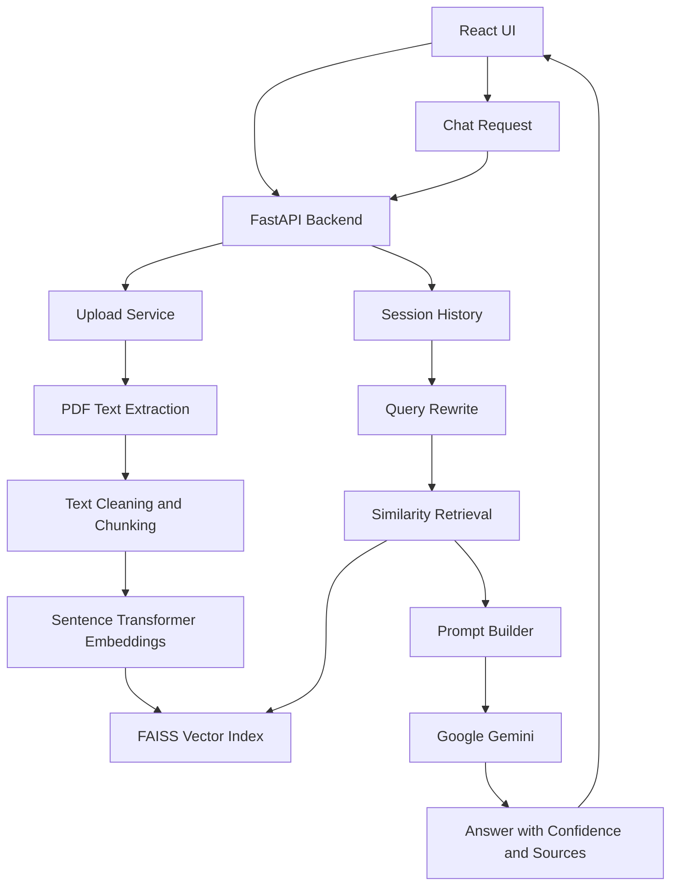

# HyperRAG Engine

HyperRAG Engine is a full-stack Retrieval-Augmented Generation (RAG) application for asking grounded questions over PDF documents. Users can upload PDFs, create chat sessions, ask natural language questions, and receive Gemini-generated answers with confidence scores and expandable source citations.

The project is built as an interview-ready AI product, not just a backend demo. It includes a polished React interface, document ingestion, semantic retrieval, citation display, markdown answer rendering, loading states, error handling, and a deployment-friendly API configuration.


## Product Highlights

- PDF upload and automatic ingestion
- Text extraction with PyMuPDF
- Recursive document chunking
- Sentence Transformer embeddings
- FAISS vector search
- Google Gemini answer generation
- Session-based chat workflow
- Query rewriting using recent chat history
- Confidence score for answers
- Expandable source cards with page references
- Markdown rendering for generated answers
- Frontend streaming-style answer reveal
- Loading, empty, and error states
- Responsive desktop and mobile layout
- Deployment-ready frontend API configuration via `VITE_API_URL`

## Demo Flow

1. Start the backend and frontend.
2. Create a chat session from the sidebar.
3. Upload a PDF.
4. Ask one of the example prompts from the welcome screen.
5. Review the generated answer, confidence score, and supporting source snippets.

Example prompts:

- `Summarize this document in 5 bullet points.`
- `What are the most important interview questions in this PDF?`
- `Create a quick study guide from the uploaded document.`
- `What evidence supports the main recommendation?`

## Tech Stack

### Frontend

- React 18
- TypeScript
- Vite
- Tailwind CSS
- TanStack React Query
- Axios
- Lucide React
- React Hot Toast

### Backend

- Python
- FastAPI
- SQLAlchemy
- SQLite
- PyMuPDF
- FAISS
- Sentence Transformers
- Google GenAI SDK

### AI/RAG Pipeline

- PDF text extraction
- Text cleaning
- Chunking
- Dense embeddings
- Vector similarity search
- Context-grounded prompt construction
- Gemini response generation
- Source citation return path

## Architecture



## Project Structure

```text
PDF-QA-RAG-System/
  backend/
    app/
      api/routes/          FastAPI route handlers
      core/                App configuration
      database/            SQLAlchemy database setup
      models/              Database models
      rag/                 RAG pipeline modules
        chunkers/
        cleaners/
        embeddings/
        generators/
        loaders/
        prompts/
        retrievers/
        vectorstore/
      schemas/             Pydantic request/response schemas
      services/            Business logic and orchestration
      main.py              FastAPI application entry point
    tests/                 Backend test suite
    requirements.txt
    .env
  frontend/
    src/
      components/
        chat/
        documents/
        layout/
        sessions/
      hooks/
      pages/
      services/
      types/
    package.json
    vite.config.ts
  .env.example
  README.md
```

## Getting Started

### Prerequisites

- Python 3.11+
- Node.js 18+
- Google Gemini API key

### Backend Setup

```bash
cd backend
python -m venv venv
```

Windows:

```bash
venv\Scripts\activate
```

macOS/Linux:

```bash
source venv/bin/activate
```

Install dependencies:

```bash
pip install -r requirements.txt
```

Create `backend/.env`:

```env
APP_NAME=HyperRAG Engine
DATABASE_URL=sqlite:///./pdf_rag.db
UPLOAD_DIR=app/uploads
FAISS_INDEX_DIR=app/indexes
GEMINI_API_KEY=replace_with_your_key
```

Run the backend:

```bash
python -m uvicorn app.main:app --host 127.0.0.1 --port 8000 --reload
```

Health check:

```bash
curl http://127.0.0.1:8000/health
```

### Frontend Setup

```bash
cd frontend
npm install
npm run dev
```

The frontend runs at:

```text
http://127.0.0.1:5173/
```

For production deployments, set:

```env
VITE_API_URL=https://your-backend-url.com
```

Then build:

```bash
npm run build
```

## API Endpoints

| Method | Endpoint | Description |
| --- | --- | --- |
| `GET` | `/health` | Health check |
| `POST` | `/sessions` | Create a chat session |
| `GET` | `/sessions` | List chat sessions |
| `DELETE` | `/sessions/{session_id}` | Delete a chat session |
| `POST` | `/documents/upload` | Upload and index a PDF |
| `GET` | `/documents` | List uploaded documents |
| `GET` | `/documents/{document_id}` | Get document metadata |
| `DELETE` | `/documents/{document_id}` | Delete a document |
| `POST` | `/chat` | Ask a question against indexed PDFs |

Example chat request:

```json
{
  "session_id": 1,
  "question": "Summarize this document in 5 bullet points."
}
```

Example chat response:

```json
{
  "answer": "The document explains...",
  "confidence_score": 0.82,
  "sources": [
    {
      "document_id": 1,
      "page": 2,
      "text": "Relevant source text..."
    }
  ]
}
```

## Current MVP Status

Completed:

- Product branding as HyperRAG Engine
- Welcome screen with example prompts
- Markdown rendering for answers
- Cleaner source cards with expand/collapse
- Frontend streaming-style answer reveal
- Loading and progress states
- Basic responsive design
- Improved frontend and backend error handling
- TypeScript contracts for chat and documents
- Deployment-friendly frontend API base URL

Known limitation:

- The current answer reveal is implemented on the frontend after the backend response completes. True token streaming from the backend is planned for a later sprint.

## Roadmap

### Sprint 1: UI/UX

- Completed: branding, welcome screen, markdown answers, source cards, loading states, responsive basics
- Next: screenshots, visual QA, accessibility pass

### Sprint 2: AI Features

- Backend token streaming
- Quick actions: summarize, quiz, flashcards
- Better confidence calibration
- Improved retrieval ranking
- Hybrid retrieval with sparse + dense search

### Sprint 3: Production

- Deploy frontend
- Deploy backend
- Configure production environment variables
- Test PDF uploads in production
- Test chat and citations in production
- Fix deployment-specific CORS, file path, and storage issues

### Sprint 4: Portfolio Polish

- Add screenshots and GIF demo
- Add live demo link
- Add architecture image
- Clean sample data and generated artifacts
- Add a short demo video

## Testing

Frontend production build:

```bash
cd frontend
npm run build
```

Backend tests:

```bash
cd backend
pytest
```

Backend syntax check example:

```bash
python -m py_compile app/services/rag_service.py
```

## Skills Demonstrated

- Full-stack AI application development
- Retrieval-Augmented Generation
- Semantic search and vector databases
- Prompt construction and grounding
- Source attribution and confidence display
- FastAPI API design
- React + TypeScript frontend engineering
- State management with React Query
- Document ingestion pipeline design
- Deployment-aware configuration

## Author

**Prajwal Vitkar**

AI and Data Science Engineering Student

- LinkedIn: https://linkedin.com/in/prajwalvitkar
- GitHub: https://github.com/CtrlAltDefeattt

## License

This project is intended to be released under the MIT License. Add a `LICENSE` file before publishing the repository publicly.
